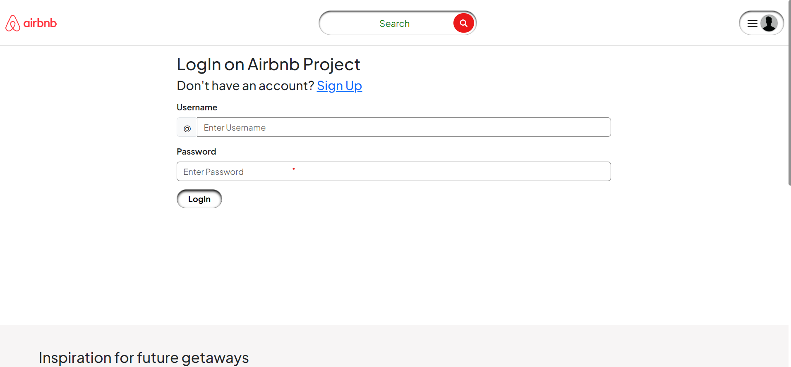

## Airbnb Clone Website
This is a clone of Airbnb, a popular online marketplace for vacation rentals. This project is built using Node.js for the backend.
<hr>

## Table of Contents

- [Project Image](#project-image)
- [Features](#features)
- [Technologies & Packages Used](#technologies--packages-used)
- [Key Features](#key-features)
- [How to Install](#how-to-install)
- [Challenges & Solutions](#challenges--solutions)
- [Author](#author)
- [Project Link](#project-link)
- [Thank You](#thank-you)

## Project Image

### Home Page


### Footer Page


### Footer Page2


### Filter Section


### Search Section


### Search Result


### Login Page


### Signup Page


### Create New Listing


### Show Page


### Rating section


### Map Section


### Edit Page


### Edit Page2


## Features

- User Authentication: Users can sign up, log in, and log out securely.
- Property Listings: Users can view available properties for rent.
- Property Details: Detailed information about each property, including description, amenities, location, and photos.
- Booking System: Users can make reservations for properties.
- Reviews and Ratings: Users can leave reviews and ratings for properties they have stayed in.

## Technologies & Packages Used

### Backend

- MongoDB: NoSQL database for flexible and scalable data storage.
- Express.js: Web application framework for Node.js, providing robust features for web and mobile applications.
- Node.js: JavaScript runtime for server-side development.

### Authentication

- Passport.js: Middleware for user authentication, supporting various strategies.
- Dotenv: Environment variable management for secure configuration.

### Image Storage

- Cloudinary: Cloud-based image and video management solution.

### Maps

- Mapbox: Platform for custom maps and location-based experiences.

### Frontend

- EJS: Embedded JavaScript templates for dynamic content rendering.

### Session Management

- Connect Flash: Middleware for flash messages.
- Connect Mongo: MongoDB session store for Express.js.
- Cookie Parser: Middleware for parsing cookies.

### Validation

- Joi: Library for data validation.

### Object Modeling

- Mongoose: MongoDB object modeling for Node.js.

### File Uploads

- Multer: Middleware for handling file uploads.

### Social Authentication

- Passport Local: Local authentication strategy.
- Passport Local Mongoose: Mongoose-specific authentication strategy. Authentication

## Key Features

- CRUD Operations: Add, Edit, and Delete Listings
- Review System: Add and Delete Reviews
- User Data Security: Password Hashing and Encryption
- Interactive Maps: Leveraging Mapbox for Location Visualization
- Login with Email: Traditional email login for user convenience

## How to Install

Follow these steps to set up and run the project locally:

1. Clone the Repository:
   
   ```bash
   git clone https://github.com/Saurabh-Sharma-1999/Airbnb-Major-Project.git

### Navigate to the project directory.

   ```bash
   cd Airbnb-Major-Project
   ```
### Install dependencies.
 
   ```bash
      npm install
   ```

### Set Up Environment Variables:

- Configure the following environment variables by creating a .env file in the root of your project:
  
```bash
  CLOUD_NAME=
  CLOUD_API_KEY=
  CLOUD_API_SECRET=
  MAP_TOKEN=
  ATLASDB_URL=
  SECRET=
```
Replace the values with your specific configurations.

### Open in Your Browser:
```bash
Open [http://localhost:8080/listing](http://localhost:8080/listing) in your web browser.
```

## Challenges & Solutions

- Encountered challenges, especially with data handling, but implemented efficient solutions. Overcame scalability issues with a well-architected backend.

## Author

- Saurabh Sharma
- Email: saurabh7411sharma@gmail.com
- LinkedIn :

## Project Link

[Live Link](https://airbnb-major-project-sbjr.onrender.com/listing)

## Thank You

Thank you for exploring Airbnb! Your feedback is valuable. If you have any suggestions or thoughts, feel free to share them with us.
